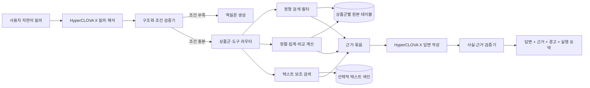

# 금융상품 Agent 과제 실행계획

## 문서 목적

이 문서는 다음 자료를 바탕으로 3인 팀이 금융상품 Agent 과제를 실제로 완수하기 위한 최종 산출물 형태, 시스템 구성, 단계별 개발 과정, 역할 분담과 검증 방법을 제안한다.

- 과제 소개자료: `과제소개_금융상품Agent.md`
- 국내채권 데이터·스키마
- 국내 ETF 데이터·스키마
- 해외 ETF 데이터·스키마
- 공모펀드 데이터·스키마

데이터 분석은 샘플만이 아니라 전체 데이터 145,393건을 기준으로 수행했다.

---

# 1. 한눈에 보는 권장안

## 1.1 추천하는 최종 결과물

최종 결과물은 단순한 챗봇 화면이 아니라 다음 4개 요소가 결합된 **API 중심 금융상품 질의·비교 Agent**가 적합하다.

1. **정형 데이터 조회·연산 엔진**
   - 4개 상품군의 검색, 필터링, 정렬, 순위, 집계, 비교를 담당한다.
   - 수치 계산은 LLM이 아니라 데이터베이스와 검증된 Python 함수가 수행한다.

2. **HyperCLOVA X 기반 질의 이해·답변 Agent**
   - 자연어 질의를 구조화된 검색 조건으로 변환한다.
   - 검색 결과를 사용자가 이해하기 쉬운 문장으로 설명한다.
   - 데이터에 없는 내용은 추측하지 않고 확인 불가 또는 역질문으로 처리한다.

3. **근거 추적 가능한 평가용 API**
   - `GET /answer`를 제공한다.
   - 답변, 검색 근거, 사용한 테이블·상품 ID·데이터 기준일, 실행 요약을 반환한다.
   - 비공개 평가 질의를 안정적으로 처리할 수 있도록 Public 망에서 운영한다.

4. **시연용 웹 화면**
   - 사용자 질문 입력
   - 해석된 검색 조건 표시
   - 추천이 아닌 조건 부합 결과 표시
   - 상품 비교표와 근거 표시
   - 데이터가 부족할 때 경고 또는 역질문 표시

## 1.2 결과물의 핵심 메시지

심사위원에게 보여줘야 할 핵심은 다음과 같다.

> “LLM이 금융상품을 추측해서 추천하는 시스템이 아니라, HyperCLOVA X가 자연어 의도를 해석하고 검증된 정형 데이터 엔진이 검색·계산한 결과를 근거와 함께 설명하는 시스템”

이 구조는 과제의 평가 요소인 정확성, 일관성, 기술 완성도, 현업 활용성, 리스크 관리를 동시에 보여주기 좋다.

## 1.3 기술 방향 한 줄 요약

**Vector DB 중심 RAG가 아니라 RDB 중심 Agentic Query + 필요한 텍스트 필드만 보조 검색하는 하이브리드 구조**를 추천한다.

금융상품 데이터는 대부분 컬럼과 수치로 구성된 정형 데이터이므로, 정확한 필터·정렬·집계에는 SQL 또는 검증된 Query Builder가 더 적합하다. Vector DB는 상품명 유사 검색, 해외 ETF 영문 운용전략 검색, 금융용어 동의어 검색 등에 제한적으로 사용하면 된다.

---

# 2. 과제에서 반드시 만족해야 하는 조건

## 2.1 필수 모델 제약

- LLM은 **HyperCLOVA X만 사용**
- 다른 LLM을 사용하면 평가 대상에서 제외
- 임베딩이나 Re-ranker 등 비-LLM 모델 사용 가능 여부는 공식 Q&A에서 확인
- 불명확한 경우 다른 생성형 LLM은 사용하지 않는 방향으로 설계

## 2.2 필수 기능

- 4개 상품군별 검색
- 복수 조건 필터링
- 상품 상세 조회
- 상품 간 비교
- 정렬·순위·집계 연산
- 상품군 교차 질의
- 근거 기반 설명
- 정보가 부족한 질문에 대한 역질문
- 데이터에서 확인할 수 없는 내용의 명시적 거절

## 2.3 제출 필수 항목

1. 소스코드
2. 재현 가능한 실행 환경
   - `Dockerfile`
   - `requirements.txt` 또는 동등한 의존성 정의
3. `README.md`
   - 환경 구성
   - 실행 명령어
4. 기술 제안서
5. 평가용 API 서버 정보
   - Endpoint URL
   - 요청·응답 스키마
6. Public 망에서 접근 가능한 서버

## 2.4 주요 일정

- 예선 제출 마감: 09.06
- API 활성화 유지 예정 기간: 09.07-09.20
- 예선 평가: 09.07-09.30
- 결과 발표: 10.01
- 마감 이후 코드·결과물·서버 배포 변경 시 실격 가능

---

# 3. 실제 데이터 분석 결과

## 3.1 데이터 전체 규모

| 상품군 | 행 수 | 컬럼 수 | 주요 식별자 |
|---|---:|---:|---|
| 국내채권 | 42,394 | 40 | `PD_NO` |
| 국내 ETF | 1,734 | 73 | `pd_itm_no`, `pd_itm_no_ma`, 거래소 코드 |
| 해외 ETF | 5,646 | 49 | `pd_itm_no`, `pd_isin_cd` |
| 공모펀드 | 95,619 | 45 | `itm_no`, `prfd_attr_cd` |
| **합계** | **145,393** | 상품군별 상이 | - |

## 3.2 국내채권

### 활용하기 좋은 정보

- 상품명·약어명
- 상품 중분류·소분류
- 채권 종류
- 통화
- 발행일·만기일
- 표면금리
- 위험등급
- 신용등급
- 잔존일수
- 듀레이션
- 평가가격

### 실제 데이터 특징

- 상품 중분류는 100% 채워져 있다.
- 회사채 31,447건, 특수채 8,755건, 국공채 2,137건 등으로 구성된다.
- 채권 종류는 약 97.82% 채워져 있으며 39개 유형이다.
- 통화는 대부분 KRW이지만 USD·EUR·JPY와 비정상적으로 보이는 `000` 값도 있다.
- 신용등급 관련 컬럼은 약 58-65%만 채워져 있다.
- 잔존일수는 약 74.89%, 듀레이션은 약 68.45%, 평가가격은 약 75.06% 채워져 있다.

### 가장 중요한 주의점

- 매수수익률, 세후수익률, 매수가능수량 등은 **전체의 약 2.08%인 881건**만 값이 있다.
- 따라서 “세후수익률이 가장 높은 국내채권” 같은 질문은 전체 채권 순위가 아니라 **수익률 값이 제공된 일부 매수 가능 종목 내 순위**라고 밝혀야 한다.
- 신용등급 값은 `AAA, AAA, AAA`처럼 평가회사별 등급이 결합되어 있으므로 검색용 대표등급 정규화가 필요하다.

## 3.3 국내 ETF

### 활용하기 좋은 정보

- 상품명·약어명
- 운용사
- 위험등급
- 투자자산군
- 투자지역
- 레버리지 배수
- 1일·1개월·3개월·6개월·1년·YTD 수익률
- AUM·NAV·거래대금·거래량
- 연금거래 가능 여부
- 핵심 ETF 여부

### 실제 데이터 특징

- 운용사, 위험등급, 투자자산군, 투자지역은 100% 채워져 있다.
- 투자자산군은 주식 1,069건, 채권 261건, 원자재 207건 등이 있다.
- 투자지역은 국내 1,036건, 미국 453건, 글로벌 76건 등이 있다.
- 위험등급은 매우 높은 위험 761건, 높은 위험 667건 등이다.
- 레버리지 배수는 약 89.45% 존재하며 -3배에서 3배까지 확인된다.
- AUM은 약 83.79%, 기간별 수익률은 대체로 약 79-90% 존재한다.

### 가장 중요한 주의점

- 기초지수는 **3.34%**만 값이 있다.
- 총보수는 **12.51%**만 값이 있다.
- `pd_dvid_cycl`, `pd_sect_nm`, 실시간 가격·거래량, 장중 iNAV·괴리율 컬럼은 전체가 비어 있다.
- `pd_pen_risk_nm`에는 `위험자산`, `안전자산`뿐 아니라 `N`도 들어 있어 값 정규화가 필요하다.
- 일부 수익률에 -100%, 1년 수익률 2,738.95% 같은 극단값이 있으므로 이상값 검토와 원문 표시가 필요하다.
- 총보수가 없는 상품을 0% 보수로 해석하면 안 된다.

## 3.4 해외 ETF

### 활용하기 좋은 정보

- 티커·ISIN
- 상장시장
- 거래통화
- 기초지수
- 운용사
- 총보수
- 지수 복제 방식
- 영문 운용전략
- 투자자산 유형
- 투자지역
- AUM
- 가격·거래량

### 실제 데이터 특징

- 총보수는 100% 채워져 있고 중앙값은 0.49, 범위는 0-2.5다.
- 운용사와 기초지수는 약 99.86% 채워져 있다.
- 투자자산 유형은 Equity 2,500건, Alternatives 1,800건, Bond 1,084건 등이다.
- 투자지역은 미국 4,196건, Global 718건, Global Ex US 303건 등이다.
- AUM은 약 96.69% 존재한다.
- 거래통화는 모두 USD다.

### 가장 중요한 주의점

- 레버리지 배수 컬럼은 전체가 비어 있다.
- 1일 수익률은 약 95.43% 채워져 있지만 확인된 값이 전부 0이다. 실질적인 수익률 비교에 사용하면 안 된다.
- 기초지수 컬럼에는 실제 지수명 외에 다음과 같은 “미제공” 문구가 많이 포함된다.
  - `Index is not provided by Management Company`
  - `Index is not available on Lipper Database`
- 지수복제방식은 약 41.8%만 존재한다.
- 핵심 ETF 여부는 약 1.82%만 값이 있으며 모두 `N`이므로 필터 의미가 제한적이다.
- 해외 ETF의 영문 분류값과 국내 ETF의 한글 분류값을 교차 비교하려면 표준 분류 매핑이 필요하다.

## 3.5 공모펀드

### 활용하기 좋은 정보

- 상품명·약어명
- 운용속성
- 투자지역
- 국내·해외 구분
- 벤치마크
- 환헤지 여부
- 1주-5년 기간별 수익률
- 순자산
- 위험등급
- 판매 여부
- 당사 판매 여부

### 실제 데이터 특징

- 통화는 KRW 95,046건, USD 572건이다.
- 투자지역은 글로벌 42,875건, 국내 33,223건, 아시아 10,265건 등이다.
- 운용속성은 주식형 36,338건, 재간접 30,243건, 채권혼합 8,964건, 채권형 8,344건 등이다.
- 판매중 76,318건, 판매완료 19,300건이다.
- 순자산은 약 86.89% 존재한다.
- 위험등급명은 약 80.74% 존재한다.

### 가장 중요한 주의점

- 보수 정보가 없다. 공모펀드 보수 비교 질문은 제공 데이터만으로 답할 수 없다고 밝혀야 한다.
- 수익률 결측이 많다.
  - 1주 수익률: 약 72.63%
  - 1개월 수익률: 약 72.36%
  - 1년 수익률: 약 67.38%
  - 3년 수익률: 약 58.37%
  - 5년 수익률: 약 53.17%
- `exchdg_yn`에 `00080008`, 운용속성에 `06`, 당사판매여부에 ISIN처럼 보이는 값이 1건씩 있어 행 또는 컬럼 이상 여부를 확인해야 한다.
- 위험등급 표기가 `높은 위험`과 `높은위험`처럼 혼재한다.
- 극단적인 장기수익률 값이 있어 범위 검증과 원문 보존이 필요하다.

## 3.6 데이터 전반의 결론

1. 결측값과 0은 완전히 다르게 취급해야 한다.
2. “값 없음”, “실제 0”, “제공기관 미제공”, “해당 없음”을 구분해야 한다.
3. 상품군마다 동일 개념의 컬럼명·언어·값 체계가 다르다.
4. 전체 상품군을 하나의 거대한 공통 테이블로 억지로 합치면 정보 손실이 크다.
5. 공통 검색용 표준 뷰와 상품군별 원본 테이블을 함께 유지하는 방식이 좋다.
6. 데이터가 희소한 조건은 답변에 데이터 가용 범위를 명시해야 한다.
7. 수익률 극단값을 임의 삭제하기보다 품질 플래그를 붙이고 원문값을 보존해야 한다.

---

# 4. 권장 최종 결과물의 상세 형태

## 4.1 사용자가 보는 화면

시연용 화면은 다음 순서로 보이는 것이 좋다.

### 상단: 자연어 질문

예:

> “미국 주식에 투자하는 국내 ETF 중 1년 수익률이 있고, 위험등급 3등급 이하인 상품을 AUM 순으로 5개 비교해줘.”

### 중단 1: 질의 해석 결과

```text
상품군: 국내 ETF
투자지역: 미국
투자자산군: 주식
위험등급: 1-3등급
필수값: 1년 수익률 존재
정렬: AUM 내림차순
결과 수: 5
```

사용자가 Agent의 해석을 확인할 수 있어야 한다. 잘못 해석한 경우 조건을 수정할 수 있으면 시연 효과가 좋다.

### 중단 2: 결과 비교표

| 상품명 | 운용사 | 위험등급 | 투자지역 | 1년 수익률 | AUM | 근거 |
|---|---|---|---|---:|---:|---|
| 상품 A | 운용사 A | 2등급 | 미국 | 값 | 값 | 국내ETF / 상품 ID |

### 하단: 근거 기반 설명

- 조건에 부합한 이유
- 상품별 주요 차이
- 결측값 또는 비교 불가능 항목
- 데이터 기준일
- 참조 테이블·상품 ID
- 투자 추천이 아니라 데이터 조회·비교 결과라는 안내

## 4.2 평가자에게 제공할 API 응답

권장 응답 구조:

```json
{
  "question_id": "Q-001",
  "question": "평가 질의 원문",
  "answer": "최종 답변",
  "retrieved_context": {
    "data_as_of": "2026-07-11",
    "tables": ["PREF01N001"],
    "products": [
      {
        "product_id": "상품 식별자",
        "product_name": "상품명",
        "matched_fields": {
          "투자지역": "미국",
          "위험등급": "높은위험(2등급)"
        }
      }
    ]
  },
  "execution_trace": {
    "intent": "compare",
    "product_types": ["domestic_etf"],
    "filters": [],
    "sort": [],
    "missing_conditions": [],
    "tools_used": ["search_products", "compare_products"]
  },
  "warnings": [
    "이 결과는 2026-07-11 스냅샷 데이터 기준입니다."
  ]
}
```

과제 자료의 `think_trace` 요구는 내부 Chain-of-Thought 원문을 그대로 노출하기보다 **해석한 조건, 호출한 도구, 적용한 필터, 참조 행을 담은 감사 가능한 실행 요약**으로 구현하는 것이 안전하고 재현성도 높다. 최종 필드명은 주최 측 공식 API 명세가 나오면 그 명세에 맞춘다.

## 4.3 최종 제출 패키지

```text
project/
├── app/
│   ├── api/
│   ├── agent/
│   ├── retrieval/
│   ├── domain/
│   └── ui/
├── data/
│   ├── raw/
│   ├── processed/
│   ├── mappings/
│   └── quality_reports/
├── evaluation/
│   ├── golden_questions.jsonl
│   ├── expected_results/
│   └── run_evaluation.py
├── tests/
│   ├── unit/
│   ├── integration/
│   └── regression/
├── docs/
│   ├── architecture.md
│   ├── data_dictionary.md
│   ├── api_spec.md
│   ├── risk_and_limitations.md
│   └── technical_proposal.pdf
├── Dockerfile
├── requirements.txt
├── README.md
└── docker-compose.yml
```

---

# 5. 권장 시스템 구조

## 5.1 전체 흐름



## 5.2 저장 구조

### 원본 테이블 4개

- `domestic_bond`
- `domestic_etf`
- `overseas_etf`
- `public_fund`

상품군 고유 컬럼을 모두 보존한다.

### 공통 검색 뷰

다음과 같은 공통 필드만 표준화한다.

| 공통 필드 | 설명 |
|---|---|
| `product_type` | 국내채권·국내 ETF·해외 ETF·공모펀드 |
| `product_id` | 상품군별 고유 식별자 |
| `product_name` | 상품명 |
| `short_name` | 상품약어명 |
| `currency` | 통화 |
| `asset_type` | 주식·채권·원자재·혼합 등 표준 분류 |
| `region` | 국내·미국·글로벌·중국 등 표준 분류 |
| `risk_level` | 가능한 경우 1-6등급 표준화 |
| `aum_or_net_assets` | AUM 또는 순자산 |
| `sale_status` | 판매·거래 가능 상태 |
| `data_as_of` | 2026-07-11 |

공통 필드가 없는 상품은 `NULL`로 유지하고, `0`을 넣지 않는다.

### 표준 분류 매핑

별도 매핑 테이블을 둔다.

- 국내 ETF `주식` ↔ 해외 ETF `Equity`
- 국내 ETF `채권` ↔ 해외 ETF `Bond`
- `미국` ↔ `United States of America`
- `글로벌` ↔ `Global`
- `높은 위험` ↔ `높은위험`
- Y/N, 1/0, 판매중/판매완료 등 상태값

원본값과 표준값을 모두 보존한다.

## 5.3 자연어 질의의 구조화 형식

HyperCLOVA X가 자유문장이나 SQL을 바로 만들게 하지 말고 다음과 같은 허용된 JSON 구조를 생성하게 한다.

```json
{
  "intent": "search | detail | compare | aggregate | explain",
  "product_types": ["domestic_etf"],
  "filters": [
    {
      "field": "region",
      "operator": "eq",
      "value": "미국"
    },
    {
      "field": "return_1y",
      "operator": "not_null"
    }
  ],
  "metrics": ["return_1y", "aum"],
  "sort": [
    {
      "field": "aum",
      "direction": "desc"
    }
  ],
  "limit": 5,
  "clarification_needed": false,
  "clarification_question": null
}
```

검증기는 다음을 검사한다.

- 허용된 상품군인가?
- 해당 상품군에 존재하는 필드인가?
- 연산자가 필드 타입과 맞는가?
- 단위가 명확한가?
- 정렬 기준이 존재하는가?
- “좋은 상품”, “안전한 상품”처럼 기준이 모호하지 않은가?
- 결과 수 제한이 있는가?

## 5.4 Agent 도구

처음부터 많은 도구를 만들기보다 다음 6개로 시작한다.

### `resolve_schema`

- 사용자 표현을 실제 컬럼과 표준 필드에 매핑
- 예: “규모” → AUM 또는 순자산

### `search_products`

- 조건 필터
- 상품 검색
- 정렬
- 상위 N개 반환

### `get_product_detail`

- 상품 ID 기준 상세 조회
- 상품군 고유 필드 포함

### `compare_products`

- 같은 상품군 또는 상품군 간 공통 지표 비교
- 비교 불가능한 필드는 `N/A`와 사유 반환

### `aggregate_products`

- 개수, 평균, 중앙값, 최솟값, 최댓값
- 그룹별 집계

### `build_evidence`

- 참조 테이블
- 상품 ID
- 사용 컬럼
- 데이터 기준일
- 결측·품질 경고

## 5.5 SQL 안전성

- LLM이 임의 SQL을 데이터베이스에 직접 실행하지 않게 한다.
- 허용 필드와 연산자만 지원하는 Query Builder를 사용한다.
- 읽기 전용 DB 계정을 사용한다.
- 행 수 제한과 쿼리 시간 제한을 둔다.
- 모든 실행 쿼리 또는 Query Plan을 로그로 남긴다.
- 사용자 입력을 문자열 연결로 SQL에 삽입하지 않는다.

## 5.6 답변 생성 규칙

답변 프롬프트에 다음 규칙을 강제한다.

1. 검색 결과에 있는 값만 사용한다.
2. 결측값은 0으로 표현하지 않는다.
3. 데이터 기준일을 표시한다.
4. 순위는 사용된 모집단과 결측 제외 조건을 설명한다.
5. 공모펀드 보수처럼 데이터에 없는 정보는 확인 불가라고 답한다.
6. 전망 또는 단정적 투자 추천을 생성하지 않는다.
7. 모호한 조건은 역질문한다.
8. 상품 비교 시 같은 단위와 같은 기간의 지표만 비교한다.

---

# 6. 단계별 진행 과정

전체 예선 기간을 약 6주로 보고 구성한 권장 일정이다. 실제 남은 기간에 맞춰 각 단계를 압축할 수 있지만 순서는 유지하는 것이 좋다.

## 단계 0. 팀 운영 방식 확정 - 1일

### 목표

- 역할과 의사결정 구조를 분명히 한다.
- 제출 하루 전이 아니라 최소 3일 전을 내부 마감으로 정한다.

### 해야 할 일

- GitHub Repository와 브랜치 전략 설정
- Issue·Project board 생성
- 코드 리뷰 규칙 설정
- 매일 15분 진행 공유
- 주 2회 통합 테스트 시간 고정
- 중요 의사결정 기록 방식 설정

### 역할

| 팀원 | 담당 |
|---|---|
| 공학 계열 | Repository, 개발 환경, CI 기본 구성 |
| 경영 계열 | 목표 사용자·문제 정의·우선순위 합의 주도 |
| 자료조사 담당 | 공식 공지·Q&A·요구사항 목록화, 변경사항 기록 |

### 완료 기준

- 모든 작업에 담당자와 마감일이 있다.
- “무엇을 만들지”를 한 문장으로 세 명이 동일하게 설명한다.

## 단계 1. 데이터 계약과 품질 기준 수립 - 3-5일

### 목표

Agent가 사용할 수 있는 값과 사용할 수 없는 값을 명확히 구분한다.

### 해야 할 일

1. 4개 스키마 검토
2. 컬럼을 다음 그룹으로 분류
   - 식별자
   - 이름
   - 분류
   - 가격·규모
   - 수익률
   - 위험
   - 날짜
   - 판매·거래 상태
3. 공통 검색 필드 정의
4. 상품군별 전용 필드 정의
5. 결측률 리포트 작성
6. 이상값 규칙 정의
7. 원본값-표준값 매핑표 작성
8. 단위와 수익률 기간 정의

### 역할

| 팀원 | 주담당 | 구체적 업무 |
|---|---|---|
| 공학 계열 | 데이터 파이프라인 | 타입 변환, 적재 스크립트, 데이터 검증 코드, DB 스키마 |
| 경영 계열 | 금융 의미 검토 | 보수·수익률·AUM·NAV·위험등급·만기 등 의미와 비교 가능 조건 정의 |
| 자료조사 담당 | 데이터 사전·품질 리포트 | 컬럼별 정의, 값 예시, 결측률, 이상값, 공식 용어 조사 |

### 함께 검토할 항목

- 비어 있는 총보수를 0으로 처리하지 않는가?
- 국내채권 수익률의 모집단을 명확히 표시하는가?
- 해외 ETF 1일 수익률을 사용할 수 없는 값으로 판단하는가?
- 공모펀드 보수 정보가 없음을 시스템이 알고 있는가?

### 완료 산출물

- `data_dictionary.md`
- `field_mapping.csv`
- `data_quality_report.md`
- 재실행 가능한 적재·정제 스크립트

### 완료 기준

- 원본 파일에서 DB를 한 번의 명령으로 재생성할 수 있다.
- 원본 행 수와 적재 행 수가 일치한다.
- 모든 표준 필드가 원본 컬럼으로 역추적된다.

## 단계 2. 평가 질문 설계 - 단계 1과 병행, 3-5일

### 목표

평가 질문이 공개되기 전에 예상 질의 유형을 체계적으로 만든다.

### 권장 질문 분류

| 유형 | 예시 | 최소 문항 |
|---|---|---:|
| 단일 상품 조회 | 특정 상품의 운용사와 위험등급 | 15 |
| 조건 검색 | 미국 주식형 국내 ETF 검색 | 20 |
| 정렬·순위 | AUM 상위 5개 | 15 |
| 상품 비교 | 2-3개 상품 보수·수익률 비교 | 15 |
| 집계 | 지역별 상품 수, 유형별 평균 | 10 |
| 상품군 교차 | 국내 ETF와 해외 ETF 비교 | 15 |
| 결측·불가 | 공모펀드 보수 질문 | 15 |
| 모호한 질문 | “좋은 상품 추천” | 10 |
| 동의어·오탈자 | 규모/순자산/AUM, 미국/US | 10 |
| 공격·안전성 | 프롬프트 인젝션, 임의 SQL 요구 | 10 |

총 **120-150개 이상의 Golden Question Set**을 권장한다.

### 역할

| 팀원 | 담당 |
|---|---|
| 경영 계열 | 실제 금융 소비자·영업·심사 관점 질문 작성, 기대 답변 구조 정의 |
| 자료조사 담당 | 질문 다양화, 동의어·오탈자·경계 사례 작성, 정답 근거 확인 |
| 공학 계열 | 질문을 자동 테스트 형식으로 변환, 정확도 측정 코드 작성 |

### 완료 산출물

- `golden_questions.jsonl`
- 질문별 기대 상품 ID 또는 기대 조건
- 정답 근거 행
- 거절·역질문 기대 여부

## 단계 3. 결정론적 검색 엔진 구현 - 5-7일

### 목표

LLM 없이도 구조화된 조건을 넣으면 정확한 결과가 나오는 기반을 만든다.

### 구현 순서

1. 상품군별 상세 조회
2. 문자열·범주 조건 필터
3. 수치 범위 필터
4. 날짜·만기 조건
5. 정렬과 상위 N개
6. 집계
7. 같은 상품군 비교
8. 상품군 교차 비교
9. 근거 생성

### 권장 기술

- 빠른 로컬 개발: DuckDB 또는 SQLite
- 배포 환경: PostgreSQL
- API: FastAPI
- 데이터 검증: Pydantic 또는 명시적 Schema Validator
- 텍스트 검색: DB Full-Text Search 우선
- Vector DB: 필요성이 확인된 텍스트 필드에만 선택적으로 도입

### 역할

| 팀원 | 주담당 | 구체적 업무 |
|---|---|---|
| 공학 계열 | 검색 엔진 구현 | DB, Query Builder, 도구 함수, 단위 테스트 |
| 경영 계열 | 검색 정책 검증 | 어떤 조건이 금융적으로 타당한지, 비교 가능 여부 검토 |
| 자료조사 담당 | 테스트 데이터 검증 | 검색 결과를 원본 CSV와 대조, 오류 사례 기록 |

### 완료 기준

- Golden Question 중 구조화 검색 문제의 95% 이상이 기대 결과와 일치한다.
- 동일 입력에 항상 동일 결과가 나온다.
- 결측값이 정렬에서 0처럼 취급되지 않는다.

## 단계 4. HyperCLOVA X 질의 해석기 구현 - 4-6일

### 목표

자연어를 검증 가능한 구조화 JSON으로 변환한다.

### 구현 내용

- 상품군 감지
- 의도 분류
- 금융용어·동의어 매핑
- 필터·정렬·제한 수 추출
- 수익률 기간 구분
- 비교 대상 추출
- 조건 모호성 판단
- 역질문 생성

### 중요한 설계

- 프롬프트에 전체 스키마를 무조건 넣지 않는다.
- 먼저 상품군을 판단한 뒤 관련 스키마만 제공한다.
- 출력은 JSON Schema로 제한한다.
- JSON 파싱 실패 시 재시도 횟수를 제한한다.
- 허용되지 않은 필드나 연산자는 Validator가 거절한다.

### 역할

| 팀원 | 주담당 | 구체적 업무 |
|---|---|---|
| 공학 계열 | API 연동·JSON 검증 | HyperCLOVA X 호출, 재시도, 캐시, 오류 처리 |
| 경영 계열 | 프롬프트·의도 체계 | 금융 표현, 모호성 기준, 역질문 문구 |
| 자료조사 담당 | 표현 사전 | 동의어, 약어, 한영 매핑, 실제 질문 변형 수집 |

### 완료 기준

- 질문의 상품군·조건·정렬·기간 추출 정확도를 별도로 측정한다.
- 모호한 질문에 임의 조건을 채우지 않고 역질문한다.
- LLM 출력이 잘못되어도 DB에 임의 쿼리가 실행되지 않는다.

## 단계 5. 답변 생성과 근거 추적 - 3-5일

### 목표

검색 결과를 정확하고 일관된 답변 형식으로 변환한다.

### 권장 답변 템플릿

1. 결론
2. 적용한 조건
3. 결과 비교표
4. 상품별 차이 설명
5. 결측·품질 경고
6. 참조 테이블·상품 ID·데이터 기준일
7. 필요 시 비추천 안내 또는 역질문

### 역할

| 팀원 | 주담당 | 구체적 업무 |
|---|---|---|
| 공학 계열 | 근거 객체·검증기 | 답변 수치와 검색 결과 일치 검사, API 응답 구성 |
| 경영 계열 | 답변 문체·컴플라이언스 | 추천처럼 보이지 않는 표현, 금융 설명의 명확성 검토 |
| 자료조사 담당 | 사실 검수 | 답변과 원본 데이터 대조, 근거 누락 및 과장 표현 점검 |

### 자동 검증 규칙

- 답변에 등장한 상품 ID가 검색 결과에 존재하는가?
- 답변의 숫자가 검색 결과의 숫자와 일치하는가?
- 단위와 기간이 맞는가?
- 데이터 기준일이 표시됐는가?
- 결측값을 숫자로 표현하지 않았는가?
- 데이터에 없는 정보를 생성하지 않았는가?

## 단계 6. 평가용 API와 시연 UI - 4-6일

### API 구현

- `GET /answer`
- `GET /health`
- 내부 운영용 `GET /ready`
- 요청별 타임아웃
- 오류 코드
- 요청 ID와 로그
- 동시 요청 처리
- Rate Limit

### UI 구현

UI는 화려함보다 평가 기능을 명확히 보여주는 데 집중한다.

- 질문 입력
- 예시 질문
- 해석된 조건
- 결과 비교표
- 근거와 데이터 기준일
- 품질 경고
- 응답 시간

### 역할

| 팀원 | 담당 |
|---|---|
| 공학 계열 | FastAPI, 배포, 상태 점검, 간단한 UI 연결 |
| 경영 계열 | 화면 정보 우선순위, 사용자 시나리오, 데모 흐름 |
| 자료조사 담당 | 예시 질문, 도움말, 제한사항 문구, 사용자 관찰 테스트 |

### 완료 기준

- Public 네트워크에서 평가 요청이 성공한다.
- 서버 재시작 후 자동 복구된다.
- 입력 오류와 내부 오류가 구분된다.
- 10회 이상 연속 호출에서 응답 스키마가 유지된다.

## 단계 7. 통합평가와 성능 개선 - 5-7일

### 평가 지표

| 영역 | 지표 |
|---|---|
| 질의 이해 | 상품군·필터·정렬·기간 추출 정확도 |
| 검색 | 기대 상품 ID Precision@K, Recall@K |
| 계산 | 정렬·집계 결과 정확도 |
| 답변 | 근거 일치율, 수치 일치율, 거절 정확도 |
| 안정성 | 오류율, JSON 스키마 준수율 |
| 성능 | 평균·P95 응답시간 |
| 리스크 | 근거 없는 문장 비율, 추천성 표현 발생률 |

### 오류 분류

- 의도 분류 오류
- 컬럼 매핑 오류
- 값 정규화 오류
- SQL·필터 오류
- 비교 불가능 지표 혼합
- 결측 처리 오류
- 답변 생성 오류
- 근거 누락
- 타임아웃

### 역할

| 팀원 | 담당 |
|---|---|
| 공학 계열 | 자동 평가 실행, 병목·오류 수정, 캐시·인덱스 최적화 |
| 경영 계열 | 답변 품질 블라인드 평가, 현업 활용성·리스크 평가 |
| 자료조사 담당 | 오답 원인 라벨링, 회귀 테스트 추가, 근거 재검증 |

## 단계 8. 제출 패키징과 동결 - 3-4일

### 해야 할 일

- 새 환경에서 Docker 빌드
- README만 보고 제3자가 실행
- API 명세 검증
- 기술 제안서 완성
- 아키텍처·흐름도 정리
- Golden Set 최종 실행
- 서버 비용·Credit 확인
- 최종 Git commit SHA 기록
- 제출 이후 변경 방지 절차 수립

### 역할

| 팀원 | 담당 |
|---|---|
| 공학 계열 | Docker, 배포, API 문서, 운영 Runbook |
| 경영 계열 | 기술 제안서, 발표자료, 데모 스크립트, 기대효과 |
| 자료조사 담당 | 요구사항 추적표, 인용·수치 검수, 제출 체크리스트 |

### 완료 기준

- 깨끗한 환경에서 한 번에 실행된다.
- 제출 항목이 공식 요구사항과 1:1로 대응한다.
- 발표 중 사용할 질문과 실패 시 대체 시나리오가 준비되어 있다.
- 최종 커밋 이후 변경하지 않는다.

---

# 7. 팀원별 권장 역할

## 7.1 공학 계열 팀원 - Tech Lead / Backend·Agent Engineer

### 주책임

- 전체 기술 아키텍처
- 데이터 적재·정제 파이프라인
- DB와 Query Builder
- HyperCLOVA X 연동
- Agent 도구
- FastAPI
- Docker·배포·모니터링
- 자동 테스트

### 피해야 할 상황

- 모든 구현을 혼자 맡는 것
- 금융 의미를 확인하지 않고 컬럼명만 보고 로직을 만드는 것
- LLM 프롬프트 튜닝만 반복하고 검색 엔진 검증을 미루는 것

### 매주 내야 할 결과

- 실행 가능한 코드
- 테스트 결과
- 성능과 오류 로그
- 다음 주 기술 위험 목록

## 7.2 경영 계열 팀원 - Product Owner / 금융 도메인·제안서 Lead

### 주책임

- 문제 정의와 사용자 가치
- 금융 용어와 질의 의도 체계
- 비교 가능한 지표 기준
- 답변 정책
- 투자 추천·환각 리스크 관리
- 사용자 시나리오
- 기술 제안서와 발표

### 구체적으로 해야 할 일

- “좋은 상품”, “안전한 상품”, “수익률이 높은 상품”의 모호성을 정의
- 어떤 경우 역질문해야 하는지 결정
- 상품군별 핵심 비교항목 정의
- 데이터가 없을 때 보여줄 문구 작성
- 답변을 일반 사용자가 이해할 수 있는지 검토

### 피해야 할 상황

- 발표자료만 마지막에 작성하는 역할이 되는 것
- 개발 완료 후 결과를 수동으로 설명하는 데 그치는 것
- 금융적으로 비교 불가능한 지표를 한 표에 넣는 것

## 7.3 자료조사 담당 팀원 - Data QA / Research·Evaluation Lead

### 주책임

- 공식 공지와 Q&A 추적
- 데이터 사전
- 데이터 결측·이상값 조사
- 외부 용어·분류 조사
- Golden Question Set
- 정답 근거 검증
- 회귀 테스트와 제출 검수

### 구체적으로 해야 할 일

- 매 질문의 기대 상품 ID와 근거 행 확인
- 오답을 원인별로 분류
- 동의어·약어·오탈자 목록 관리
- 외부 데이터를 사용할 경우 출처·기준일·충돌 규칙 기록
- 기술 제안서에 들어가는 수치와 주장을 원본 데이터로 검증

### 피해야 할 상황

- 인터넷 검색 결과를 그대로 정답으로 사용하는 것
- 데이터 가공 과정을 문서화하지 않는 것
- 테스트를 개발 완료 후 시작하는 것

## 7.4 공동 책임

다음은 한 명에게만 맡기면 안 된다.

- 최종 문제 정의
- 데이터 정규화 규칙 승인
- Golden Question의 기대 답변 승인
- 주 2회 통합 테스트
- 최종 데모 리허설
- 제출 체크

---

# 8. 단계별 RACI 요약

표기:

- **A**: 최종 책임
- **R**: 실행 담당
- **C**: 검토·자문
- **I**: 공유받음

| 작업 | 공학 계열 | 경영 계열 | 자료조사 |
|---|---|---|---|
| 시스템 아키텍처 | A/R | C | I |
| 문제 정의·사용자 가치 | C | A/R | C |
| 데이터 적재·DB | A/R | C | C |
| 금융 필드 의미·비교 기준 | C | A/R | R |
| 데이터 품질 분석 | R | C | A/R |
| 표준 분류 매핑 | R | A | R |
| Golden Question 작성 | C | A/R | R |
| 기대 정답·근거 검증 | C | A | R |
| 검색·연산 엔진 | A/R | C | C |
| HyperCLOVA X 연동 | A/R | R | C |
| 답변 정책·역질문 | C | A/R | R |
| API·Docker·배포 | A/R | I | C |
| 자동 평가 | A/R | C | R |
| 기술 제안서 | C | A/R | R |
| 발표·데모 | R | A/R | C |
| 공식 공지 추적 | I | C | A/R |
| 최종 제출 검수 | R | A | R |

---

# 9. 우선 구현할 대표 사용자 시나리오

## 시나리오 1. 국내 ETF 조건 검색

> “미국 주식에 투자하는 국내 ETF 중 위험등급 3등급 이내이고 1년 수익률이 있는 상품을 AUM 순으로 5개 보여줘.”

검증 항목:

- 투자지역·자산군·위험등급 복합 필터
- 결측 제외
- AUM 정렬
- 근거 표시

## 시나리오 2. 해외 ETF 보수 비교

> “S&P 500을 추종하는 해외 ETF 중 총보수가 낮은 상품 5개를 비교해줘.”

검증 항목:

- 기초지수의 미제공 문구 제외
- 문자열 유사 검색
- 총보수 정렬
- 동일 지수 판단 기준

## 시나리오 3. 국내채권 수익률

> “매수 가능한 회사채 중 세후수익률이 높은 5개를 알려줘.”

검증 항목:

- 수익률 값이 존재하는 2.08%의 일부 종목만 대상
- 매수 가능 수량 확인
- 결과 모집단 제한 안내
- 만기·신용등급 함께 표시

## 시나리오 4. 공모펀드 장기성과

> “판매 중인 국내 주식형 공모펀드 중 3년 수익률이 있는 상품을 순자산 순으로 비교해줘.”

검증 항목:

- 판매 상태
- 운용속성
- 투자지역
- 3년 수익률 존재 여부
- 순자산 정렬

## 시나리오 5. 확인 불가능한 질문

> “공모펀드 중 총보수가 가장 낮은 상품을 알려줘.”

기대 동작:

- 공모펀드 데이터에 보수 정보가 없다고 명시
- 임의 추정 금지
- 외부 데이터 사용이 허용되고 구축돼 있다면 출처와 기준일을 구분해 안내

## 시나리오 6. 모호한 추천

> “지금 사기 좋은 안전한 상품 추천해줘.”

기대 동작:

- 단정적 추천 금지
- 상품군, 투자기간, 허용 위험등급, 통화, 필요한 수익률 기간 등을 역질문

---

# 10. 우선순위와 범위 조절

## 10.1 반드시 구현할 MVP

- 4개 상품군 적재
- 상품 상세 조회
- 복수 조건 필터
- 정렬·상위 N개
- 동일 상품군 비교
- 기본 상품군 교차 비교
- 근거와 기준일 표시
- 결측·확인 불가 처리
- HyperCLOVA X 질의 구조화
- `GET /answer`
- Docker 실행
- Golden Question 자동평가

## 10.2 시간이 남으면 추가

- 사용자 수정 가능한 질의 조건 UI
- 상품명 퍼지 검색
- 해외 ETF 운용전략 Vector Search
- 결과 다운로드
- 질의 처리 단계 시각화
- 응답 캐시
- 관리자용 품질 대시보드

## 10.3 초기에 하지 않는 것을 권장

- 전체 필드를 Vector DB에 넣는 작업
- 복잡한 Multi-Agent 구조
- 실시간 금융시세 연동
- 근거 없는 개인화 추천
- 지나치게 화려한 프론트엔드
- GraphDB를 쓰기 위한 GraphDB 도입

3인 팀에서는 복잡성보다 **정확한 검색·연산, 데이터 품질, 평가 자동화, 안정적 API**가 점수에 더 직접적으로 기여할 가능성이 높다.

---

# 11. 주요 위험과 대응

| 위험 | 영향 | 대응 |
|---|---|---|
| HyperCLOVA X 외 LLM 사용 | 평가 제외 | 생성형 LLM 호출 경로를 한 곳으로 통제하고 의존성 검사 |
| 결측을 0으로 처리 | 잘못된 순위·비교 | NULL 유지, `not_null` 조건, 답변 경고 |
| LLM이 임의 SQL 생성 | 보안·정확성 저하 | 허용 JSON + Query Builder + 읽기 전용 DB |
| 상품군 간 단위 혼합 | 잘못된 비교 | 표준 단위 메타데이터와 비교 가능성 검사 |
| 데이터에 없는 보수·수익률 추정 | 환각·규칙 위반 | 확인 불가 응답과 역질문 |
| 극단값을 그대로 추천 근거로 사용 | 답변 신뢰도 저하 | 품질 플래그, 원본값 표시, 이상값 경고 |
| 외부 데이터와 제공 데이터 충돌 | 평가 오답 | 제공 데이터를 기준 데이터로 우선 |
| API 평가 기간 장애 | 정량평가 실패 | Health Check, 자동 재시작, 모니터링, 사전 부하 테스트 |
| 클라우드 Credit 초과 | 서버 중단·비용 | 예산 알림, 로그·캐시·인스턴스 크기 관리 |
| 마감 이후 변경 | 실격 | 제출 commit SHA와 배포 이미지 digest 고정 |

---

# 12. 기술 제안서 구성안

1. 한 장 요약
2. 문제 정의
3. 사용자와 핵심 시나리오
4. 데이터 분석 결과
5. 데이터 품질 문제와 해결 방식
6. 시스템 아키텍처
7. 질의 이해와 Agent 오케스트레이션
8. 검색·연산 엔진
9. 근거 추적과 환각 방지
10. 평가 방법과 정량 결과
11. API·배포 구조
12. 리스크 관리
13. 현업 활용성
14. 확장 계획
15. 데모 시나리오

제안서에서는 “어떤 기술을 많이 사용했는지”보다 “왜 이 데이터와 평가 방식에 이 구조가 적합한지”를 강조한다.

---

# 13. 최종 완료 기준

## 기능

- [ ] 4개 상품군을 모두 조회할 수 있다.
- [ ] 복합 조건을 해석하고 필터링한다.
- [ ] 정렬·순위·집계를 정확히 수행한다.
- [ ] 같은 기간·단위의 값만 비교한다.
- [ ] 상품군 교차 질의를 처리한다.
- [ ] 정보 부족 시 역질문한다.
- [ ] 데이터에 없는 내용은 확인 불가라고 답한다.

## 데이터

- [ ] 원본 행 수와 적재 행 수가 일치한다.
- [ ] 결측값과 0을 구분한다.
- [ ] 원본값과 표준화값을 모두 보존한다.
- [ ] 모든 결과가 원본 행으로 역추적된다.
- [ ] 수익률·보수·AUM의 단위가 정의돼 있다.
- [ ] 품질 이상값에 플래그가 있다.

## 답변

- [ ] 상품명·숫자·단위가 검색 결과와 일치한다.
- [ ] 데이터 기준일이 표시된다.
- [ ] 참조 테이블과 상품 ID가 표시된다.
- [ ] 전망이나 단정적 투자 추천을 하지 않는다.
- [ ] 동일 질문에 일관된 답변을 한다.

## API·운영

- [ ] Public 망에서 접근 가능하다.
- [ ] 공식 요청·응답 스키마를 준수한다.
- [ ] Health Check가 있다.
- [ ] 오류와 타임아웃이 처리된다.
- [ ] API 활성화 기간 운영 계획이 있다.
- [ ] 서버 비용과 Credit을 모니터링한다.

## 제출

- [ ] Docker로 재현 가능하다.
- [ ] README만으로 실행 가능하다.
- [ ] 기술 제안서가 완성됐다.
- [ ] API 명세가 있다.
- [ ] Golden Question 평가 결과가 있다.
- [ ] 최종 커밋과 배포 버전이 고정됐다.

---

# 14. 결론

이 과제에서 가장 경쟁력 있는 결과물은 “LLM이 금융 지식을 많이 말하는 챗봇”이 아니다. **서로 다른 4개 금융상품 데이터의 구조와 결측 특성을 정확히 이해하고, 자연어를 안전한 검색·연산으로 변환하며, 모든 답변을 원본 데이터로 증명하는 Agent**다.

3인 팀의 역할은 다음처럼 나누는 것이 효율적이다.

- 공학 계열 팀원은 정확하고 안정적인 검색·Agent·API 시스템을 만든다.
- 경영 계열 팀원은 금융 의미, 사용자 가치, 답변 정책과 제안서를 책임진다.
- 자료조사 담당 팀원은 데이터 품질, 정답 근거, 공식 요구사항과 평가 체계를 책임진다.

세 역할이 따로 움직이는 것이 아니라, 데이터 계약과 Golden Question을 공통 기준으로 연결돼야 한다. 개발 초기부터 평가 질문과 근거 검증을 병행하면 마지막에 프롬프트만 급하게 조정하는 상황을 피하고, 정량평가와 정성평가 모두에 강한 결과물을 만들 수 있다.

---

## 참고한 로컬 자료

- `과제소개_금융상품Agent.md`
- `1.금융상품/국내채권_데이터.csv`
- `1.금융상품/국내채권_스키마.csv`
- `1.금융상품/국내ETF_데이터.csv`
- `1.금융상품/국내ETF_스키마.csv`
- `1.금융상품/해외ETF_데이터.csv`
- `1.금융상품/해외ETF_스키마.csv`
- `1.금융상품/공모펀드_데이터.csv`
- `1.금융상품/공모펀드_스키마.csv`

